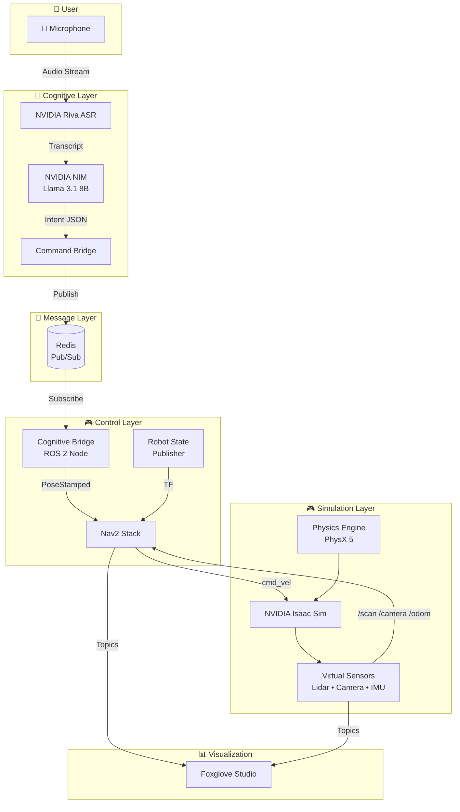
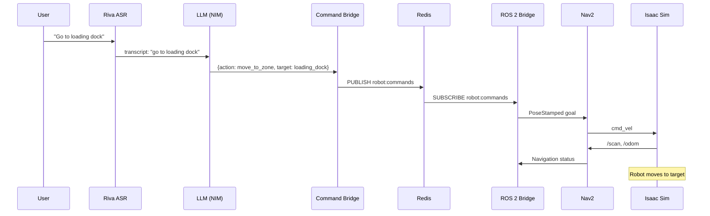
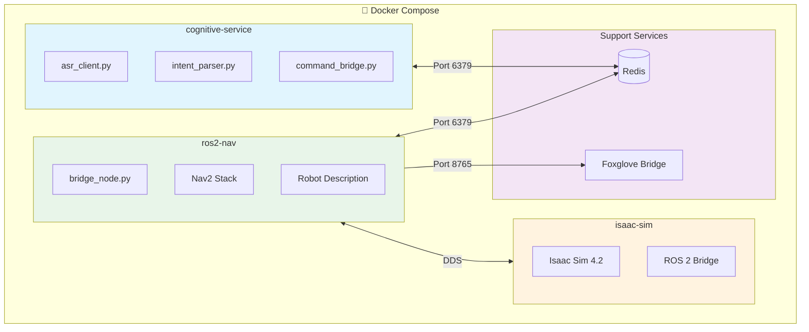
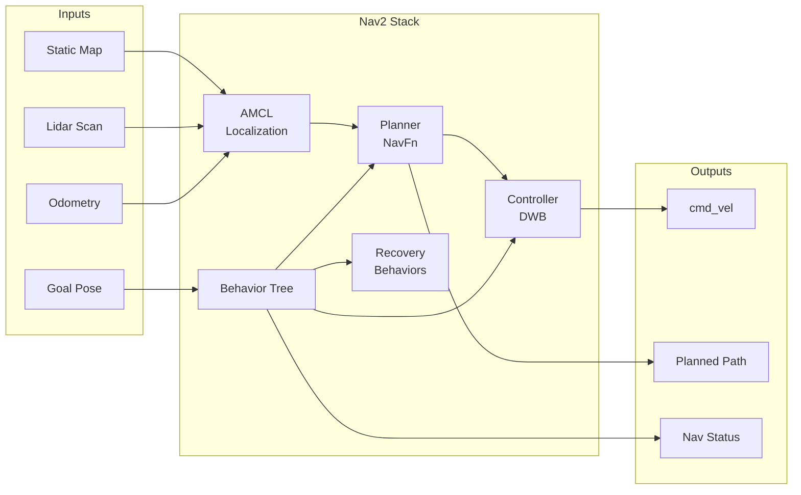
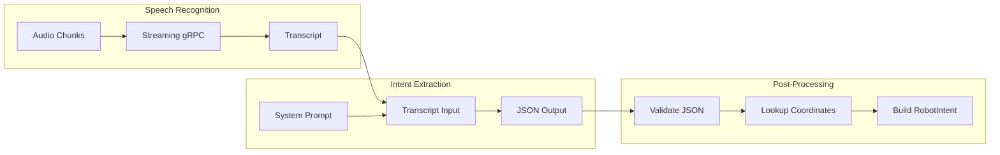
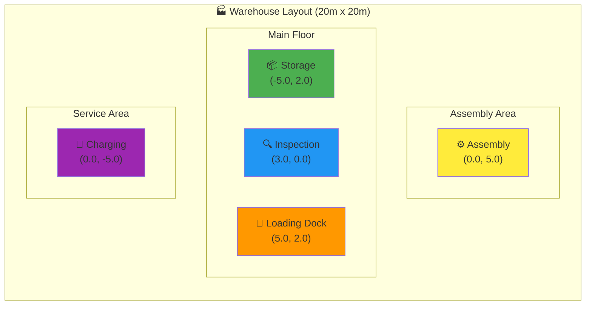
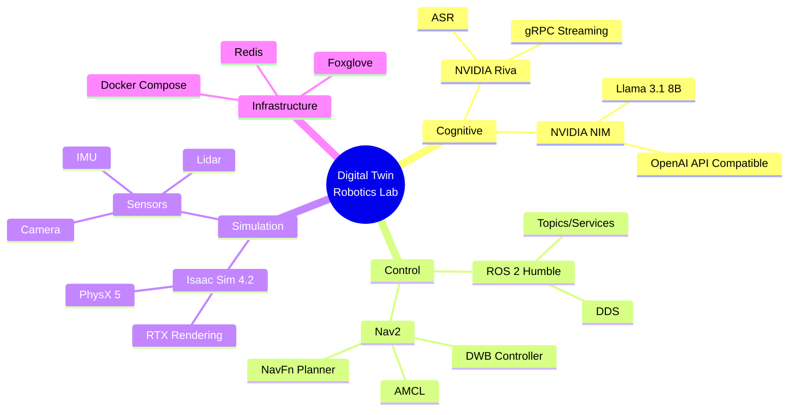

# System Architecture

## High-Level Architecture

```mermaid
flowchart TB
    subgraph User["👤 User"]
        MIC[🎤 Microphone]
    end

    subgraph Cognitive["🧠 Cognitive Layer"]
        RIVA[NVIDIA Riva ASR]
        NIM[NVIDIA NIM<br/>Llama 3.1 8B]
        BRIDGE_PUB[Command Bridge]
    end

    subgraph Messaging["📨 Message Layer"]
        REDIS[(Redis<br/>Pub/Sub)]
    end

    subgraph Control["🎮 Control Layer"]
        BRIDGE_SUB[Cognitive Bridge<br/>ROS 2 Node]
        NAV2[Nav2 Stack]
        RSP[Robot State<br/>Publisher]
    end

    subgraph Simulation["🎮 Simulation Layer"]
        ISAAC[NVIDIA Isaac Sim]
        SENSORS[Virtual Sensors<br/>Lidar • Camera • IMU]
        PHYSICS[Physics Engine<br/>PhysX 5]
    end

    subgraph Visualization["📊 Visualization"]
        FOX[Foxglove Studio]
    end

    MIC -->|Audio Stream| RIVA
    RIVA -->|Transcript| NIM
    NIM -->|Intent JSON| BRIDGE_PUB
    BRIDGE_PUB -->|Publish| REDIS
    REDIS -->|Subscribe| BRIDGE_SUB
    BRIDGE_SUB -->|PoseStamped| NAV2
    NAV2 -->|cmd_vel| ISAAC
    ISAAC --> SENSORS
    SENSORS -->|/scan /camera /odom| NAV2
    PHYSICS --> ISAAC
    RSP -->|TF| NAV2
    NAV2 -->|Topics| FOX
    SENSORS -->|Topics| FOX
```

## Data Flow Sequence

```mermaid
sequenceDiagram
    participant U as User
    participant R as Riva ASR
    participant L as LLM (NIM)
    participant CB as Command Bridge
    participant RD as Redis
    participant ROS as ROS 2 Bridge
    participant N as Nav2
    participant I as Isaac Sim

    U->>R: "Go to loading dock"
    R->>L: transcript: "go to loading dock"
    L->>CB: {action: move_to_zone, target: loading_dock}
    CB->>RD: PUBLISH robot:commands
    RD->>ROS: SUBSCRIBE robot:commands
    ROS->>N: PoseStamped goal
    N->>I: cmd_vel
    I->>N: /scan, /odom
    N->>ROS: Navigation status
    Note over I: Robot moves to target
```

## Container Architecture

```mermaid
graph TB
    subgraph Docker["🐳 Docker Compose"]
        subgraph cognitive["cognitive-service"]
            ASR[asr_client.py]
            INTENT[intent_parser.py]
            CMDBRIDGE[command_bridge.py]
        end

        subgraph ros2["ros2-nav"]
            BRIDGE[bridge_node.py]
            NAV2S[Nav2 Stack]
            ROBOT[Robot Description]
        end

        subgraph isaac["isaac-sim"]
            SIM[Isaac Sim 4.2]
            ROSBRIDGE[ROS 2 Bridge]
        end

        subgraph services["Support Services"]
            REDIS2[(Redis)]
            FOX2[Foxglove Bridge]
        end
    end

    cognitive <-->|Port 6379| REDIS2
    ros2 <-->|Port 6379| REDIS2
    ros2 <-->|DDS| isaac
    ros2 -->|Port 8765| FOX2

    style cognitive fill:#e1f5fe
    style ros2 fill:#e8f5e9
    style isaac fill:#fff3e0
    style services fill:#f3e5f5
```

## Navigation Stack

```mermaid
flowchart LR
    subgraph Input["Inputs"]
        GOAL[Goal Pose]
        SCAN[Lidar Scan]
        ODOM[Odometry]
        MAP[Static Map]
    end

    subgraph Nav2["Nav2 Stack"]
        AMCL[AMCL<br/>Localization]
        PLAN[Planner<br/>NavFn]
        CTRL[Controller<br/>DWB]
        REC[Recovery<br/>Behaviors]
        BT[Behavior Tree]
    end

    subgraph Output["Outputs"]
        VEL[cmd_vel]
        PATH[Planned Path]
        STATUS[Nav Status]
    end

    GOAL --> BT
    MAP --> AMCL
    SCAN --> AMCL
    ODOM --> AMCL
    AMCL --> PLAN
    PLAN --> CTRL
    BT --> PLAN
    BT --> CTRL
    BT --> REC
    CTRL --> VEL
    PLAN --> PATH
    BT --> STATUS
```

## Intent Processing Pipeline

```mermaid
flowchart LR
    subgraph ASR["Speech Recognition"]
        A1[Audio Chunks]
        A2[Streaming gRPC]
        A3[Transcript]
    end

    subgraph LLM["Intent Extraction"]
        L1[System Prompt]
        L2[Transcript Input]
        L3[JSON Output]
    end

    subgraph Parse["Post-Processing"]
        P1[Validate JSON]
        P2[Lookup Coordinates]
        P3[Build RobotIntent]
    end

    A1 --> A2 --> A3
    A3 --> L2
    L1 --> L2
    L2 --> L3
    L3 --> P1 --> P2 --> P3
```

## Zone Map

```mermaid
graph TB
    subgraph Warehouse["🏭 Warehouse Layout (20m x 20m)"]
        direction TB
        
        subgraph Top["Assembly Area"]
            ASSEMBLY["⚙️ Assembly<br/>(0.0, 5.0)"]
        end
        
        subgraph Middle["Main Floor"]
            STORAGE["📦 Storage<br/>(-5.0, 2.0)"]
            INSPECTION["🔍 Inspection<br/>(3.0, 0.0)"]
            LOADING["🚛 Loading Dock<br/>(5.0, 2.0)"]
        end
        
        subgraph Bottom["Service Area"]
            CHARGING["🔋 Charging<br/>(0.0, -5.0)"]
        end
    end

    style ASSEMBLY fill:#ffeb3b
    style STORAGE fill:#4caf50
    style INSPECTION fill:#2196f3
    style LOADING fill:#ff9800
    style CHARGING fill:#9c27b0
```

## Technology Stack

```mermaid
mindmap
    root((Digital Twin<br/>Robotics Lab))
        Cognitive
            NVIDIA Riva
                ASR
                gRPC Streaming
            NVIDIA NIM
                Llama 3.1 8B
                OpenAI API Compatible
        Control
            ROS 2 Humble
                DDS
                Topics/Services
            Nav2
                AMCL
                DWB Controller
                NavFn Planner
        Simulation
            Isaac Sim 4.2
                PhysX 5
                RTX Rendering
            Sensors
                Lidar
                Camera
                IMU
        Infrastructure
            Docker Compose
            Redis
            Foxglove
```
